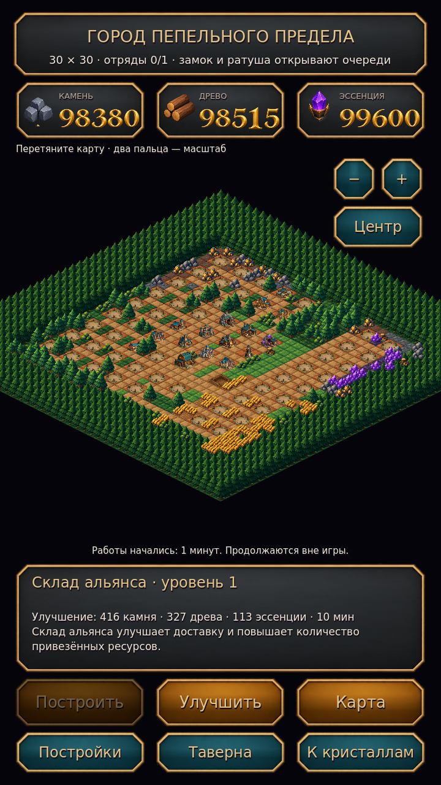

# Пепельный предел

**Исходный проект 1.4.0 · Godot 4.6.3 · Android · тёмное фэнтези · три в ряд**

Процедурные поля разных форм, шесть целей, молнии, взрывы и боссы на каждом десятом уровне. Между боями развивайте изометрический город и отправляйте героев с войсками к месторождениям на отдельной карте. Обе территории — 30 × 30 клеток с лесами, полями, дорогами и рудниками.

APK 1.3.0 ниже — предыдущая сборка, без новых таймеров и экономики. Актуальные изменения находятся в исходном проекте; новая APK пока не собиралась.

**[Скачать Android APK 1.3.0](https://github.com/manderer55-svg/-xzc/raw/refs/heads/main/downloads/ashen-veil-debug.apk)** — Android 7.0+, ARM64/ARM32. Устанавливайте поверх прежней версии, чтобы сохранить прогресс. [Контрольная сумма](downloads/ashen-veil-debug.apk.sha256) · [Сборка](docs/ANDROID.md).



[Строительство](art/preview/construction.png) · [Карта ресурсов](art/preview/region_overview.png) · [Поход отряда](art/preview/expedition.png) · [Герои](art/preview/heroes.png) · [Войска](art/preview/army.png) · [Матч-3](art/preview/gameplay.png) · [Готовый бункер](art/preview/bunker_3.png)

Кристаллы различаются шестью силуэтами: капля, ромб, треугольник, шестигранник, звезда и осколок. Цвет цельный, грани крупные. Новая графика города, земли, деревьев, войск и героев — мультяшное тёмное фэнтези. Изометрические территории собираются из сгенерированных тайлов и отдельных объектов; камера перемещается и масштабируется. Фоны, панели, цифры HUD, фишки, усилители, эффекты и этапы бункера также сгенерированы. Код размещает и анимирует готовые текстуры; подписи используют лицензированные шрифты. Рамки панелей сохраняют углы благодаря 9-slice, контур поля следует клеткам и отверстиям.

## Игровой цикл

Обменивайте фишки касаниями или свайпами. Цели: очки, сбор цвета, разрушение печатей, зарядка алтарей, доставка реликвии вниз, победа над боссом. Генератор поддерживает 1000+ уровней, восемь силуэтов, размеры 7–9 клеток и три региона: лес, ледяной некрополь, вулканические руины. На каждом десятом уровне — региональный босс.

В городе доступны 64 участка и 15 типов зданий: замок, ратуша, цитадель, кузница, рынок, конюшня, казармы, стрельбище, таверна и другие. Здания развиваются до двадцатого уровня с реальными таймерами строительства и улучшений. Назначенная работа продолжается после закрытия игры. Бункер строится через фундамент и стены. Постройки усиливают отряды и следующие попытки матч-3. Для добавления зданий предусмотрен расширяемый каталог; здания альянса пока дают местные бонусы снабжения.

На карте выберите конечное месторождение и отправьте свободного героя с тремя воинами. Начальная очередь одна; замок или ратуша уровней 2–4 открывают до четырёх. Отряд выходит из замка, добывает весь запас и возвращает груз на склад. Только доставленный груз входит в баланс. Исчерпанное месторождение исчезает и через 15 минут появляется в новом доступном месте.

Бран доступен с начала. Эйра, Морвен и Каэл открываются за три карты; карты также повышают уровень героев до пятого. Первое прохождение каждого третьего или десятого уровня даёт карту. В таверне сундук за ресурсы содержит три карты. Пехота, стрелки и конница обучаются в соответствующих зданиях.

Сохраняются постройки, герои, карты, войска, остатки месторождений, отряды с грузом, бункер и настройки. Девять участков из старых сохранений сохраняют свои здания. Звук включает атмосферную тему и эффекты разрушений, молний, каскадов и победы. Можно отключить звук, вибрацию и уменьшить эффекты. Переиспользуются фишки, эффекты, звуковые голоса и персонажи; карта скрывает объекты за пределами камеры.

[Правила и экономика](docs/GAMEPLAY.md) · [Оригиналы графики](art/darkfantasy/README.md) · [Отчёт проверок](docs/VALIDATION.md) · [Независимый визуальный аудит](docs/VISUAL_AUDIT.md)

## Разработка

Откройте `project.godot` в Godot 4.6.3, нажмите F5. В облаке:

```bash
cd /workspace/-xzc
bash tools/run_game.sh
bash tools/check.sh
bash tools/render_previews.sh
```

Для Android:

```bash
bash tools/setup_android.sh
ASHEN_BASELINE_APK=downloads/ashen-veil-debug.apk bash tools/export_android.sh
```

Результат — `builds/ashen-veil-debug.apk`. Для обновления нужен прежний ключ. [Инструкции Android](docs/ANDROID.md).

В облаке проверяются настоящая Godot-сцена, ввод, модель игры, сохранения, сборка и подпись APK. Подключённого Android-телефона нет; плавность, нагрев и реальное обновление приложения проверяются по [чеклисту устройства](docs/DEVICE_CHECKLIST.md). Для Google Play нужен release key и экспорт AAB.
