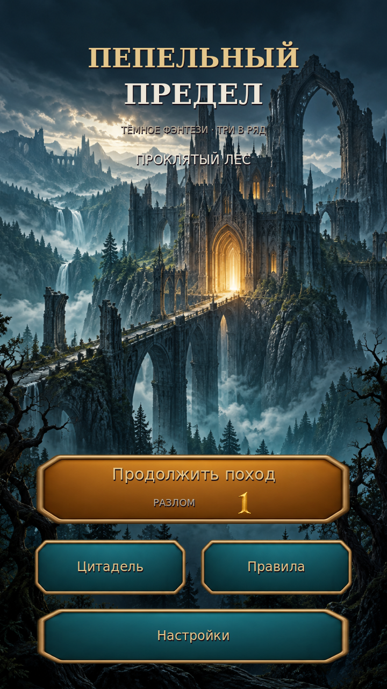

# Пепельный предел

**Версия 1.1 · Godot 4.6.3 · Android · тёмное фэнтези · три в ряд**

Поход по Проклятому лесу: процедурные поля разных форм, пять видов целей, молнии, взрывы и Страж корней на каждом десятом уровне. Между боями развивайте цитадель: здания добывают ресурсы и усиливают следующие попытки.

В версии 1.1 добавлен отдельный кинематографичный главный экран. Кристаллы перегенерированы с крупными гранями и однородным цветом, панели стали спокойнее, а золотые счётчики и крупные кнопки рассчитаны на портретный экран телефона. Фоны, кристаллы, панели, здания, ресурсы, кадры эффектов и цифры HUD — сгенерированные изображения; код размещает и анимирует готовые текстуры.

**[Скачать Android APK 1.1](https://github.com/manderer55-svg/-xzc/raw/refs/heads/main/downloads/ashen-veil-debug.apk)** — Android 7.0+, ARM64/ARM32. Разрешите установку для приложения, которым открываете APK. Для обновления с 1.0 установите поверх существующего приложения: удаление стирает локальный прогресс. [Контрольная сумма](downloads/ashen-veil-debug.apk.sha256) · [Установка и сборка](docs/ANDROID.md).



[Игровой экран](art/preview/gameplay.png) · [Бой со Стражем корней](art/preview/boss.png) · [Цитадель](art/preview/settlement.png) · [Уровень 1000](art/preview/level1000.png)

## Игровой цикл

На главном экране выберите «Продолжить поход». Обменивайте кристаллы касаниями или свайпами, выполняйте показанную цель, получайте награду за первое прохождение и стройте на отдельном изометрическом полигоне. Цели чередуются: очки, сбор указанного цвета, разрушение печатей, зарядка алтарей и победа над боссом. Генератор поддерживает 1000+ уровней, восемь силуэтов и размеры от 7 до 9 ячеек по каждой оси.

Каменоломня и лесопилка добавляют ходы, святилище даёт стартовые спецкристаллы, крепость усиливает урон боссу. Работает сильнейшая постройка каждого типа; одинаковые здания увеличивают добычу, а боевые бонусы ограничены. Бонусы фиксируются при загрузке попытки, поэтому строительство во время боя помогает следующей попытке.

Настройки сохраняют выбор вибрации и экономных эффектов. На поле переиспользуются 81 визуальная фишка и 24 спрайта эффектов; экономный режим ограничивает одновременные эффекты восемью и останавливает движение фона главного экрана. Это ограничивает число объектов, а фактическую плавность нужно проверить на телефоне.

[Правила и экономика](docs/GAMEPLAY.md) · [Оригиналы генерации](art/darkfantasy/README.md) · [Эффекты](art/preview/effects.png) · [Экран победы](art/preview/result.png) · [Настройки](art/preview/settings.png)

## Запуск проекта

Откройте `project.godot` в **Godot 4.6.3** и нажмите F5. Экран портретный; поддерживаются мышь и касание.

```bash
cd /workspace/-xzc
bash tools/run_game.sh
```

Для локальной Android-сборки:

```bash
bash tools/setup_android.sh
bash tools/export_android.sh
```

Результат — подписанный отладочный APK `builds/ashen-veil-debug.apk`. Для обновления используйте прежний ключ; проверка подписи и версии описана в [ANDROID.md](docs/ANDROID.md).

## Проверка

```bash
bash tools/check.sh
```

Проверяются рецепты первых 1000 уровней, ходы, каскады, спецобъекты, падение, все пять целей, атаки босса, сохранения, миграция данных 1.0, награды и постройки. Отдельные проверки контролируют повторное использование фишек, цифр и эффектов. Smoke-тест запускает настоящую сцену, проверяет ввод и переходы между главным экраном, боем и цитаделью. Отчёт — [VALIDATION.md](docs/VALIDATION.md).

Для снимков запущенной игры:

```bash
bash tools/render_previews.sh
ASHEN_PREVIEW_RESOLUTION=450x800 bash tools/render_previews.sh
```

Скрипт использует текущий дисплей или запускает Xorg с dummy-драйвером на `:98` и останавливает собственный дисплей после проверки. Живые процессы в новой облачной задаче не сохраняются.

В облаке проверяются desktop-сцена, структура APK, подпись и выравнивание. Подключённого Android-устройства нет; касания, нагрев, память и плавность проверяйте по [чеклисту телефона](docs/DEVICE_CHECKLIST.md). Для Google Play потребуется отдельный release key и экспорт AAB.
