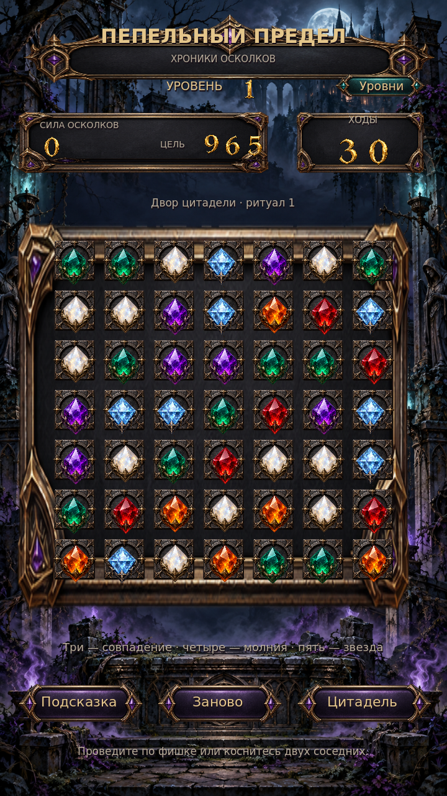

# Пепельный предел

**Godot 4.6.3 · Android · тёмное фэнтези · три в ряд**

Игровой проект с процедурными уровнями разных форм, кристаллами, молниями, взрывами, препятствиями и отдельным строительным полигоном. Графика создана генерацией изображений: фон, интерфейс, фишки, здания, ресурсы, анимационные кадры, иконка и цифры HUD. Прогресс сохраняется локально.

**[Скачать готовый Android APK](https://github.com/manderer55-svg/-xzc/raw/refs/heads/main/downloads/ashen-veil-debug.apk)** — 71,3 МиБ, Android 7.0+, ARM64/ARM32. На телефоне разрешите установку для приложения, которым открываете APK. [Контрольная сумма](downloads/ashen-veil-debug.apk.sha256).



## Запуск

Откройте `project.godot` в **Godot 4.6.3** и нажмите F5. Экран портретный, управление мышью и касанием.

```bash
cd /workspace/-xzc
bash tools/run_game.sh
```

Для Android: `bash tools/setup_android.sh`, затем `bash tools/export_android.sh`. Получится подписанный отладочный APK `builds/ashen-veil-debug.apk`, Android 7.0+, ARM64 и ARM32. Подробности и установка — [ANDROID.md](docs/ANDROID.md).

## Что можно играть

Обмен фишек → совпадения → каскады и усилители → очки → награда за первый пройденный уровень → строительство и добыча ресурсов. Есть повтор уровня, подсказка, выбор номера уровня, победа/поражение, улучшение построек и офлайн-добыча. Генератор поддерживает 1000+ номеров, восемь силуэтов и изменяемые размеры.

[Правила и экономика](docs/GAMEPLAY.md) · [Оригиналы генерации](art/darkfantasy/README.md) · [Уровень 1000](art/preview/level1000.png) · [Цитадель](art/preview/settlement.png)

[Взрыв и молния в игре](art/preview/effects.png) · [Экран победы](art/preview/result.png)

## Проверка

```bash
bash tools/check.sh
```

Проверяются генерация 1000 уровней, начальные ходы, совпадения, цепочки спецобъектов, преграды, падение, полные игровые попытки, сохранение, награды, строительство и добыча. Smoke-тест запускает настоящую сцену и проверяет обмен через ввод, очки и переход на строительный экран. Для снимков экрана нужен доступный дисплей:

```bash
bash tools/render_previews.sh
```

Скрипт использует текущий дисплей или запускает Xorg с dummy-драйвером на `:98`, делает снимки игры и останавливает только собственный дисплей. Живые процессы в новой облачной задаче не сохраняются. Это не адрес веб-превью. Подробный отчёт текущей проверки — [VALIDATION.md](docs/VALIDATION.md).

Отладочная Android-сборка проверяется на структуру, подпись и выравнивание. Проверка на физическом Android-устройстве ещё нужна. Подключённого телефона в облаке нет. Для публикации в Google Play потребуется отдельный release key и экспорт AAB.
