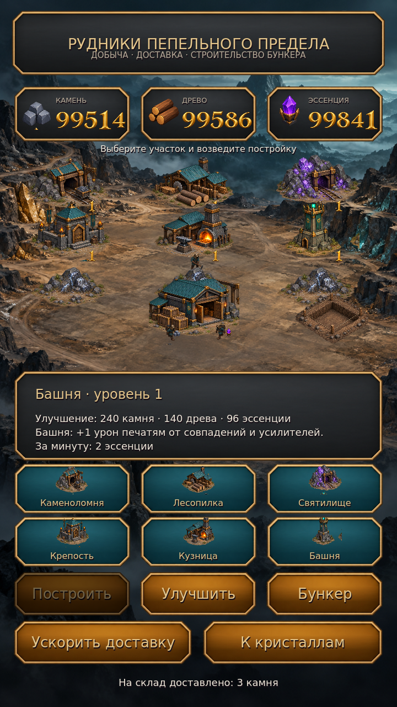

# Пепельный предел

**Версия 1.2.0 · Godot 4.6.3 · Android · тёмное фэнтези · три в ряд**

Процедурные поля разных форм, шесть целей, молнии, взрывы и боссы на каждом десятом уровне. Между боями развивайте добывающую колонию: стройте шахты, наблюдайте за рабочими, доставляйте ресурсы на склад и возводите собственный бункер.

**[Скачать Android APK 1.2.0](https://github.com/manderer55-svg/-xzc/raw/refs/heads/main/downloads/ashen-veil-debug.apk)** — Android 7.0+, ARM64/ARM32. Устанавливайте поверх прежней версии, чтобы сохранить прогресс. [Контрольная сумма](downloads/ashen-veil-debug.apk.sha256) · [Сборка](docs/ANDROID.md).



[Главная](art/preview/home.png) · [Матч-3](art/preview/gameplay.png) · [Ледяной босс](art/preview/boss_ice.png) · [Вулканический босс](art/preview/boss_lava.png) · [Готовый бункер](art/preview/bunker_3.png)

Кристаллы различаются шестью силуэтами: капля, ромб, треугольник, шестигранник, звезда и осколок. Цвет цельный, грани крупные. Фоны, панели, цифры HUD, фишки, усилители, кадры эффектов, постройки, фундамент бункера и анимации рабочих — сгенерированные изображения. Код размещает и анимирует готовые текстуры; подписи используют лицензированные шрифты. Рамки панелей сохраняют углы благодаря 9-slice, контур поля следует клеткам и отверстиям.

## Игровой цикл

Обменивайте фишки касаниями или свайпами. Цели: очки, сбор цвета, разрушение печатей, зарядка алтарей, доставка реликвии вниз, победа над боссом. Генератор поддерживает 1000+ уровней, восемь силуэтов, размеры 7–9 клеток и три региона: лес, ледяной некрополь, вулканические руины. На каждом десятом уровне — региональный босс.

На отдельном земляном полигоне доступны девять участков, шесть типов построек и склад. Рабочие обходят здания, добывают ресурсы и несут их на склад. Только доставленный груз становится доступен для строительства. Шахты имеют четыре уровня; бункер строится из пустого участка через фундамент и стены. Постройки дают бонусы следующей попытке: ходы, стартовые усилители, урон печатям и боссам, награды. Добыча за время отсутствия ограничена восемью часами и также требует доставки.

Сохраняются прогресс, постройки, очередь добычи, бункер и настройки. Звук включает атмосферную тему и эффекты разрушений, молний, каскадов и победы. Можно отключить звук, вибрацию и уменьшить эффекты. Переиспользуются 81 фишка, 24 эффекта (8 в экономном режиме), девять рабочих и восемь звуковых голосов.

[Правила и экономика](docs/GAMEPLAY.md) · [Оригиналы графики](art/darkfantasy/README.md) · [Отчёт проверок](docs/VALIDATION.md)

## Разработка

Откройте `project.godot` в Godot 4.6.3, нажмите F5. В облаке:

```bash
cd /workspace/-xzc
bash tools/run_game.sh
bash tools/check.sh
bash tools/render_previews.sh
```

Для Android:

```bash
bash tools/setup_android.sh
ASHEN_BASELINE_APK=downloads/ashen-veil-debug.apk bash tools/export_android.sh
```

Результат — `builds/ashen-veil-debug.apk`. Для обновления нужен прежний ключ. [Инструкции Android](docs/ANDROID.md).

В облаке проверяются настоящая Godot-сцена, ввод, модель игры, сохранения, сборка и подпись APK. Подключённого Android-телефона нет; плавность, нагрев и реальное обновление приложения проверяются по [чеклисту устройства](docs/DEVICE_CHECKLIST.md). Для Google Play нужен release key и экспорт AAB.
